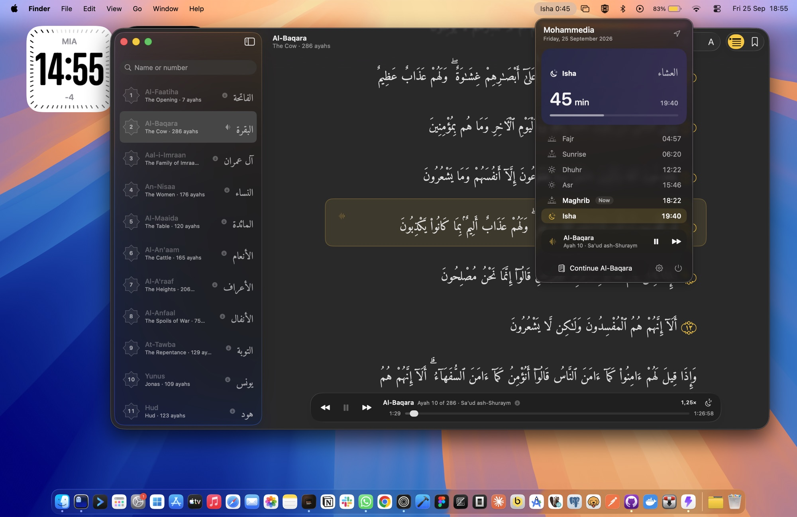

# Abrar

Abrar is a free, open-source macOS app for prayer times and the Qur'an. It lives in the menu bar, where it shows the next prayer and a countdown. It also has a Qur'an reader with streaming and offline recitation.



## Features

- **Menu bar**: shows the next prayer and a countdown (e.g. `Asr 1:24`). The popover has a card for the next prayer, today's five prayers and sunrise, and controls for the recitation that's playing.
- **Prayer times**: calculated with [Adhan](https://github.com/batoulapps/adhan-swift).
  - Every Adhan preset, plus a **Morocco (Habous)** preset calibrated against habous.gov.ma
  - Shafi/Hanafi Asr
  - Custom Fajr/Isha angles and per-prayer minute adjustments
- **Location**: automatic via CoreLocation, or pick from a bundled list of cities.
- **Notifications**: one per prayer, each can be turned off. They use a short adhan sound and are scheduled 7 days ahead. The full adhan can optionally play while the app is running.
- **Qur'an reader**: all 114 surahs in Uthmani script (Tanzil), searchable by name or number. You can change the font size, bookmark ayahs, and the app remembers where you stopped reading.
- **Recitation**:
  - Ten reciters to choose from (same catalog as quran.com)
  - The ayah being recited is highlighted and followed in the reader, including offline
  - Streaming playback
  - Media keys and Control Center support
  - Playback speed (0.5× to 2×) and a sleep timer (5 to 60 minutes, or end of surah)
  - Resumes each surah where you left off, per reciter
  - Download single surahs or all 114 for offline listening; downloads show their size and can be deleted
- **Design**: Liquid Glass on macOS 26, with a material fallback on macOS 14 and 15.
- **Launch at login**.

Requires macOS 14 or later.

## Building

Requirements: Xcode 16+ and [XcodeGen](https://github.com/yonaskolb/XcodeGen) (`brew install xcodegen`).

```sh
xcodegen
xcodebuild -project Abrar.xcodeproj -scheme Abrar -configuration Release build
```

To run the tests:

```sh
xcodebuild -project Abrar.xcodeproj -scheme Abrar test
```

You can also open `Abrar.xcodeproj` in Xcode and run the `Abrar` scheme. The project file is generated from `project.yml` and is not committed.

Debug builds add a **Fire Test Notification** button under Settings → Notifications.

### Regenerating bundled data

The bundled data is generated by scripts and committed, so you only need to run these to update it.

| Output | Script |
| --- | --- |
| `Abrar/Resources/quran.sqlite` | `python3 scripts/build_quran_db.py --refresh` (downloads the Tanzil Uthmani text and metadata) |
| `Abrar/Resources/Sounds/adhan.caf`, `adhan_full.m4a` | `scripts/build_adhan_audio.sh` |

The Qur'an text is never edited by hand. The script copies it verbatim and keeps Tanzil's copyright notice in the database's `meta` table.

## Project layout

```
Abrar/
  App/            entry point, AppModel (wiring), AppServices (service container)
  MenuBar/        menu bar label and popover
  PrayerTimes/    calculator protocol, Adhan implementation, live schedule
  Notifications/  notification scheduling, adhan playback
  Quran/          reader window, sidebar, reader model
  Audio/          reciters, player, Now Playing, downloads
  Settings/       settings store and settings window
  Core/           models, databases (GRDB), location, system services
  Resources/      quran.sqlite, cities.json, font, sounds
AbrarTests/       unit tests (Swift Testing)
scripts/          data build scripts
```

## Author

Made by **Yassine Chandid**: [yassinech.com](https://yassinech.com) · [@jakcal](https://github.com/jakcal) on GitHub.

If you find Abrar useful, consider [supporting development on Ko-fi](https://ko-fi.com/jakcal).

## Credits and licensing

Abrar's source code is released under the [MIT License](LICENSE). Bundled content keeps its own license:

| Component | Source | License |
| --- | --- | --- |
| Qur'an text (Uthmani, v1.1) | [Tanzil Project](https://tanzil.net) | [CC BY 3.0](https://creativecommons.org/licenses/by/3.0/). Must be copied verbatim with attribution and a link to tanzil.net. The full notice is stored in `quran.sqlite` (`meta.tanzil_copyright`). |
| Surah metadata | [Tanzil Project](https://tanzil.net/docs/quran_metadata) | CC BY 3.0 |
| Prayer time calculation | [Adhan Swift](https://github.com/batoulapps/adhan-swift) by Batoul Apps | MIT |
| Database | [GRDB.swift](https://github.com/groue/GRDB.swift) by Gwendal Roué | MIT |
| Recitations (streamed/downloaded, not bundled) | [QuranicAudio](https://quranicaudio.com), served by [quran.com](https://quran.com) | Free to stream and download; all rights remain with their owners |
| Ayah timings (fetched and cached, not bundled) | [quran.com](https://quran.com) audio API | Provided by quran.com. Abrar is not affiliated with or endorsed by quran.com. |
| Arabic font | [Amiri Quran](https://github.com/aliftype/amiri) by Khaled Hosny | [SIL OFL 1.1](Abrar/Resources/Fonts/AmiriQuran-OFL.txt) |
| Adhan recording | ["The Adhan - Muslim Call to Prayer - Aaqib Azeez"](https://commons.wikimedia.org/wiki/File:The_Adhan_-_Muslim_Call_to_Prayer_-_Aaqib_Azeez.mp3) by Atcovi, Wikimedia Commons | [CC BY-SA 4.0](https://creativecommons.org/licenses/by-sa/4.0/). The bundled `adhan.caf` (trimmed to 28 s, faded) and `adhan_full.m4a` (re-encoded) are derivatives under the same license. |
| City coordinates | Compiled for this project | MIT |
